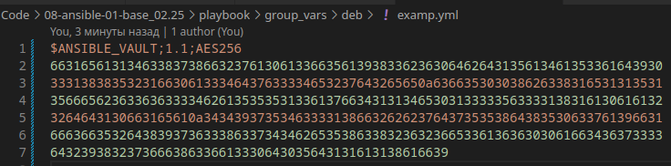

# Домашнее задание к занятию 1 «Введение в Ansible»

## Подготовка к выполнению

1. Установите Ansible версии 2.10 или выше.
2. Создайте свой публичный репозиторий на GitHub с произвольным именем.
3. Скачайте [Playbook](./playbook/) из репозитория с домашним заданием и перенесите его в свой репозиторий.

## Основная часть

1. Попробуйте запустить playbook на окружении из `test.yml`, зафиксируйте значение, которое имеет факт `some_fact` для указанного хоста при выполнении playbook.
2. Найдите файл с переменными (group_vars), в котором задаётся найденное в первом пункте значение, и поменяйте его на `all default fact`.
3. Воспользуйтесь подготовленным (используется `docker`) или создайте собственное окружение для проведения дальнейших испытаний.
4. Проведите запуск playbook на окружении из `prod.yml`. Зафиксируйте полученные значения `some_fact` для каждого из `managed host`.
5. Добавьте факты в `group_vars` каждой из групп хостов так, чтобы для `some_fact` получились значения: для `deb` — `deb default fact`, для `el` — `el default fact`.
6.  Повторите запуск playbook на окружении `prod.yml`. Убедитесь, что выдаются корректные значения для всех хостов.
7. При помощи `ansible-vault` зашифруйте факты в `group_vars/deb` и `group_vars/el` с паролем `netology`.
8. Запустите playbook на окружении `prod.yml`. При запуске `ansible` должен запросить у вас пароль. Убедитесь в работоспособности.
9. Посмотрите при помощи `ansible-doc` список плагинов для подключения. Выберите подходящий для работы на `control node`.
10. В `prod.yml` добавьте новую группу хостов с именем  `local`, в ней разместите localhost с необходимым типом подключения.
11. Запустите playbook на окружении `prod.yml`. При запуске `ansible` должен запросить у вас пароль. Убедитесь, что факты `some_fact` для каждого из хостов определены из верных `group_vars`.
12. Заполните `README.md` ответами на вопросы. Сделайте `git push` в ветку `master`. В ответе отправьте ссылку на ваш открытый репозиторий с изменённым `playbook` и заполненным `README.md`.
13. Предоставьте скриншоты результатов запуска команд.

## Необязательная часть

1. При помощи `ansible-vault` расшифруйте все зашифрованные файлы с переменными.
2. Зашифруйте отдельное значение `PaSSw0rd` для переменной `some_fact` паролем `netology`. Добавьте полученное значение в `group_vars/all/exmp.yml`.
3. Запустите `playbook`, убедитесь, что для нужных хостов применился новый `fact`.
4. Добавьте новую группу хостов `fedora`, самостоятельно придумайте для неё переменную. В качестве образа можно использовать [этот вариант](https://hub.docker.com/r/pycontribs/fedora).
5. Напишите скрипт на bash: автоматизируйте поднятие необходимых контейнеров, запуск ansible-playbook и остановку контейнеров.
6. Все изменения должны быть зафиксированы и отправлены в ваш личный репозиторий.

---

### Как оформить решение задания

Приложите ссылку на ваше решение в поле «Ссылка на решение» и нажмите «Отправить решение»
---


## Решения заданий основной части
1. Запускаем playbook на окружении из `test.yml`. Значение `some_fact` для указанного хоста при выполнении playbook равно `12`.  
     
2. Заменяем значение ключа `some_fact:` с `12` на `all default fact`  в файле `playbook/group_vars/all/examp.yml`.  
3. Подготавливаем окружение в файле `script.sh` с помощью docker для проведения дальнейших испытаний на окружении из `prod.yml`.
   ```bash
    #!/bin/bash

    NAME1=centos7
    NAME2=ubuntu

    IMAGE1=pycontribs/centos:7
    IMAGE2=pycontribs/ubuntu:latest

    docker run --rm -dit --name $NAME1 $IMAGE1
    docker run --rm -dit --name $NAME2 $IMAGE2
    ```
4. Дописываем в `script.sh` и выполняем ansible-playbook на окружении `prod.yml`:
   ```bash
   #!/bin/bash

    NAME1=centos7
    NAME2=ubuntu

    IMAGE1=pycontribs/centos:7
    IMAGE2=pycontribs/ubuntu:latest

    docker run --rm -dit --name $NAME1 $IMAGE1
    docker run --rm -dit --name $NAME2 $IMAGE2

    ansible-playbook -i inventory/prod.yml site.yml

    docker stop $NAME1 $NAME2
    ```  

   

5. Меняем значения ключей `some_fact` в файлах `playbook/group_vars/deb/examp.yml` и `playbook/group_vars/el/examp.yml` для `deb` — `deb default fact`, для `el` — `el default fact`.  
6.     
7.  При помощи `ansible-vault` шифрую факты в group_vars/deb и group_vars/el с паролем `netology`:
       
    Проверяем зашифрованные файлы:  
       
8. Изменяем строку запуска playbook в scrit.sh на:  `ansible-playbook -i inventory/prod.yml site.yml --ask-vault-pass`  
9. `ansible-doc -t connection -l`  
    выбираем: ansible.builtin.ssh      connect via SSH client binary  
10. Добавляем в файл `prod.yml` новую группу `local`:
    ```yml
    ---
    el:
        hosts:
        centos7:
            ansible_connection: docker
    
    deb:
        hosts:
        ubuntu:
            ansible_connection: docker
    
    local:
        hosts:
        debian:
            ansible_connection: local
                          ansible_host: localhost
    ```   
    
11. ВЫполняем playbook:
      